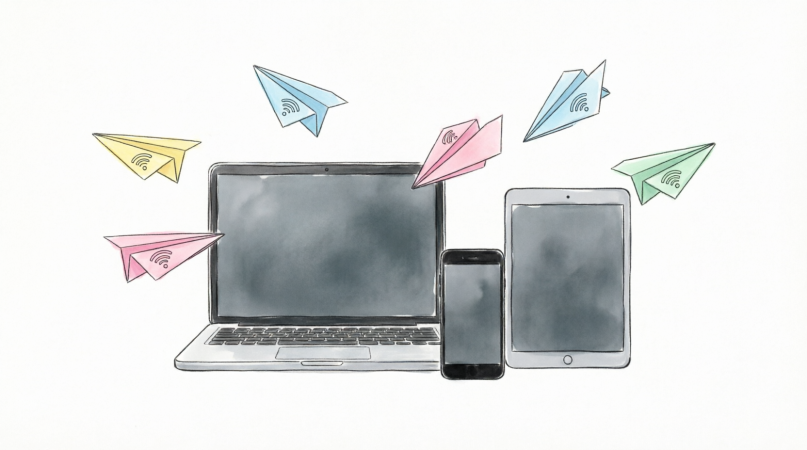
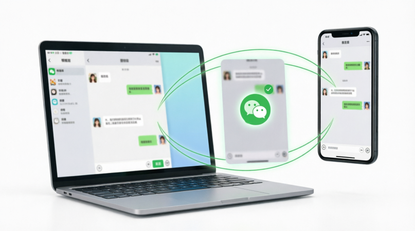
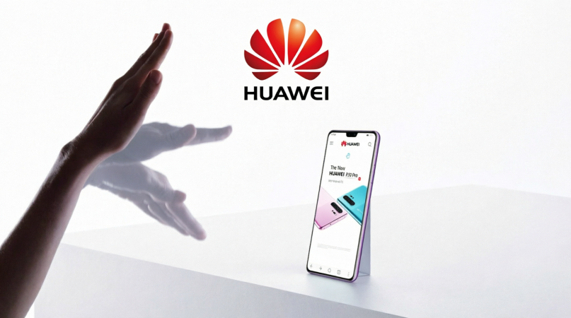
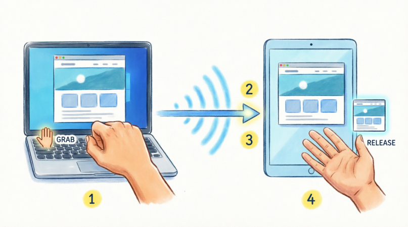

<style>
    .bottom-right {
    position: absolute;
    right: 20px;
    bottom: 20px;
    width: 50%;
  }
</style>


# GrabDrop
## Cross-Device Screenshot Transfer via 
## Air Gesture Recognition

 - *Speaker_A* 
 - *Speaker_B*
 - *Speaker_C*
 - *Speaker_D*


<div class="bottom-right"></div>

---

<!-- _class: section-title -->

# Part 1: Motivation & Overview
## *Speaker_A*

---

# The Problem: Cross-Device Screenshot Sharing

**Current pain points** when sharing screenshots between phone and laptop:

 - Chat apps (WeChat, Telegram)
 - Email
 - Cloud storage
 - USB cable

<div class="bottom-right"></div>

---

# Inspiration: Huawei Air Gesture

Introduced on select **Harmony OS** devices — grab content from screen and "drop" it to another device using hand gestures.


**Our Goal:**
- Any Android/desktop device
- CV solution only
- Fully **open-source** implementation
- LAN only

<div class="bottom-right"></div>

---

# Demo

> TODO:: video insert here

---
# Workflow

1. Both devices on **same Wi-Fi**

2. **Device A**: Show hand ~1s
   - Close fist (GRAB)
   - Screenshot captured
   - UDP broadcast sent

3. **Device B**: Show hand ~1s
   - Open hand (RELEASE)
   - TCP download
   - Image saved & opened


<div class="bottom-right"></div>

---

# Project Foundation

**Topic:** Quantization and Pruning of Lightweight Gesture Classfier

**Task:** 
 - Develop an android and desktop app
 - Train a model for gesture classification

**Our approach:** 
 - Train a lightweight TCN gesture classifier
 - Apply pruning and quantization techniques 

---


<!-- _class: section-title -->

# Part 2: AI Algorithm Design
## *Speaker_B*

---

# Two-Stage Detection Pipeline

<div class="columns">
<div>

**IDLE Stage (10 FPS)**
- Low-power scanning
- Detect hand presence
- 8/10 frames with hand → WAKEUP

</div>
<div>

**WAKEUP Stage (30 FPS)**
- High-precision classification
- TCN runs on 30-frame window
- Timeout: **2s** → return to IDLE

</div>
</div>

```
┌───────────────────┐  hand   ┌────────────────────┐
│   IDLE            │ detected│   WAKEUP           │
│   ~10 fps         ├────────►│   ~30 fps          │
│   Scan for hand   │         │   Classify gesture │
│                   │◄────────┤   Emit event       │
└───────────────────┘ timeout └────────────────────┘
```

| Stage | FPS | CPU (est.) | Duration |
|-------|-----|------------|----------|
| IDLE | 10 | 5-8% | Continuous |
| WAKEUP | 30 | 15-25% | ≤2 sec |

---

# Hand Landmark Detection (MediaPipe)

**MediaPipe Hand Landmarker** — 21 3D landmarks per frame

```
        WRIST (0)
          │
    ┌─────┼─────┬──────┬──────┬──────┐
  THUMB  INDEX  MIDDLE  RING  PINKY
   (1)   (5)    (9)   (13)  (17)
```

| Property | Value |
|----------|-------|
| Model | MediaPipe Hand Landmarker (float16) |
| Size | ~12 MB |
| Confidence | 0.3 (lowered for robustness) |
| Output | 21 × (x, y, z) = 63 dims/frame |

---

# TCN Gesture Classifier

**Why GestureTCN?**
- Lightweight: 87K params vs YOLOv8's 3M-68M
- Real-time: <2ms inference on edge devices
- Demonstrates optimization principles applicable to larger models

**Key Properties:**

| Property | Value |
|----------|-------|
| Dataset | Self-collected: 127 train / 33 test videos (PyQt5 tool) |
| Model | Temporal Convolutional Network |
| File | gesture_tcn_pruned_quantized.onnx |
| Size | 0.17 MB (~170 KB) |
| Classes | grab, release, swipe_up, swipe_down, noise |
| Input | (1, 144, 30) — batch, features, time |
| Output | (1, 5) — logits for 5 classes |
| Runtime | ONNX Runtime |

---

# TCN Architecture

**Causal dilated convolutions** for real-time streaming:

```
Input (144 features × 30 frames)
        │
        ▼
┌───────────────┐    ┌───────────────┐    ┌─────────┐
│ Stem Conv1D   │───►│ TCN Blocks    │───►│ Head    │
│ 144 → 32 ch   │    │ Dilation 1,2,4│    │ 48 → 5  │
└───────────────┘    │ RF = 19 frames│    └─────────┘
                     └───────────────┘
```

**Key Design Choices:**
- **Causal convolutions:** No future information (real-time streaming)
- **Dilated convolutions:** Large receptive field with few parameters
- **Residual connections:** Stable training, gradient flow

**Receptive Field Analysis:**
- Block 1 (d=1): 3 frames
- Block 2 (d=2): 7 frames
- Block 3 (d=4): 15 frames
- Block 4 (d=1): **19 frames** (~0.6s at 30 FPS)

---

# Feature Engineering (144 dims)

<div class="columns">
<div>

| Feature Group | Dims | Purpose |
|---------------|------|---------|
| Normalized landmarks | 63 | Position invariant |
| Velocity | 63 | Motion direction |
| Wrist velocity | 3 | Global movement |
| Finger distances | 10 | Open vs closed |
| Finger angles | 5 | Curl state |

</div>
<div>

**Normalization Pipeline:**
```
Raw (63) → Wrist-relative
        → Palm-size normalized
        → Z-score
```

**Velocity:**
```
velocity[t] = landmarks[t] - landmarks[t-1]
```

</div>
</div>

---

# Model Optimization Pipeline

```
┌─────────────┐    ┌─────────────┐    ┌─────────────┐
│  Original   │    │   Pruned    │    │  Quantized  │
│   FP32      │───►│    FP32     │───►│    INT8     │
│  87K params │    │  46K params │    │  46K params │
│  0.34 MB    │    │  0.18 MB    │    │  0.17 MB    │
└─────────────┘    └─────────────┘    └─────────────┘
                        │
                        ▼
              Fine-tune 100 epochs
```

---

# Structured Pruning

**Channel pruning with fine-tuning:**

| Config | Original | Pruned |
|--------|----------|--------|
| stem | 48 | 32 |
| mid | 48 | 32 |
| out | 64 | 48 |
| head | 32 | 24 |
| **Total params** | 87,077 | 45,877 |

**Design choices:**
- Round channels to multiple of 8 for SIMD efficiency
- Remove entire channels (structured), not individual weights
- Fine-tune 100 epochs with lower LR (1e-3)

---

# INT8 Quantization

**Post-training static quantization (PTQ) with calibration:**

**Affine quantization:** $q = \text{round}(r/s + z)$

```python
from onnxruntime.quantization import quantize_static, QuantType, QuantFormat

quantize_static(
    model_input="gesture_tcn_pruned.onnx",
    model_output="gesture_tcn_pruned_quantized.onnx",
    calibration_data_reader=calib_reader,
    quant_format=QuantFormat.QDQ,
    weight_type=QuantType.QInt8,
)
```

**Calibration:** Use representative data to determine scale $s$ and zero point $z$ for optimal quantization range.

---

<!-- _class: section-title -->

# Part 3: System Architecture
## *Speaker_C*

---

# Overall System Architecture

```
┌──────────────────── DEVICE ────────────────────────┐
│                                                    │
│  ┌──────────┐   ┌───────────────┐   ┌──────────┐ │
│  │ Camera   │──►│ MediaPipe     │──►│ Two-Stage│ │
│  │ CameraX/ │   │ Hand Landmark │   │ Pipeline │ │
│  │ OpenCV   │   │ Detector      │   │ IDLE→WAKE│ │
│  └──────────┘   └───────────────┘   └────┬─────┘ │
│                                          │        │
│     GRAB/RELEASE/SWIPE_UP/SWIPE_DOWN ◄───┤        │
│                                          ▼        │
│  ┌──────────────┐  ┌──────────────┐  ┌──────────┐│
│  │Screen Capture│  │Network Mgr   │  │Input Mgr ││
│  │MediaProjection│  │UDP discovery│  │PageUp/Down││
│  │ /spectacle   │  │TCP transfer │  │Keys      ││
│  └──────────────┘  └──────────────┘  └──────────┘│
│                                                    │
│  ┌──────────────┐  ┌──────────────┐              │
│  │Overlay Mgr   │  │Sound Player  │              │
│  │Visual fb     │  │Audio fb      │              │
│  └──────────────┘  └──────────────┘              │
└────────────────────────────────────────────────────┘
```

---

# Android Implementation

| Component | Technology | Role |
|-----------|-----------|------|
| GrabDropService | Foreground Service | Main orchestrator |
| RealGestureDetector | CameraX ImageAnalysis | Frame capture + pipeline |
| HandLandmarkDetector | MediaPipe tasks-vision | 21-landmark detection |
| GestureClassifier | ONNX Runtime Android | TCN inference |
| ScreenCaptureManager | MediaProjection | Screenshot capture |
| NetworkManager | UDP multicast + TCP | Discovery + transfer |
| OverlayManager | WindowManager | Visual feedback |
| SwipeAccessibilityService | AccessibilityService | PageUp/Down dispatch |

**Key challenges:** CameraX in Service, 12 permissions, VirtualDisplay buffering

---

# Desktop Implementation (Python)

| Module | Role |
|--------|------|
| main.py | Orchestrator |
| gesture_detector.py | Camera + two-stage pipeline |
| gesture_classifier.py | TCN model wrapper (ONNX) |
| hand_landmark.py | MediaPipe wrapper |
| screen_capture.py | Multi-backend (spectacle/grim/scrot/mss) |
| network_manager.py | UDP + TCP |
| overlay.py | Tkinter visual feedback |

```
Screen capture chain:
spectacle(KDE) → grim(Wayland) → gnome-screenshot → scrot(X11) → mss
```

---

# Network Protocol

**Zero-configuration LAN** — no pairing, no cloud

| Phase | Transport | Details |
|-------|-----------|---------|
| Discovery | UDP multicast (239.255.77.88:9877) | Heartbeat 3s, timeout 10s |
| Screenshot offer | UDP broadcast | TCP port + file size |
| Transfer | TCP | 4-byte length header + PNG |

**Retroactive matching:** RELEASE before offer → matched within 3s window

---

<!-- _class: section-title -->

# Part 4: Results & Future Work
## Speaker_D

---

# Optimization Results

| Metric | Original | Pruned | Pruned+INT8 |
|--------|----------|--------|-------------|
| **Params** | 87,077 | 45,877 | 45,877 |
| **Size** | 0.34 MB | 0.18 MB | 0.17 MB |
| **Compression** | 1.0× | 1.9× | 2.0× |
| **Accuracy** | 88.89% | 92.59% | 92.59% |
| **F1-Score** | 0.888 | 0.929 | 0.929 |
| **Latency (CPU)** | 0.92 ms | 0.79 ms | 1.23 ms |
| **Throughput** | 1087/s | 1271/s | 816/s |

> **Surprising result:** Pruning improved accuracy by +3.7%!

<!-- Speaker Notes：
These are our optimization results, it is obvious that the model after pruning and quantization is almost half of the original model. An amazing fact is that accuracy improves 3.7%!
 -->
---

# Why Did Pruning Improve Accuracy?

**Hypothesis: Pruning acts as implicit regularization**

```
Original model (87K params):
┌───────────────────────────────────────────┐
│ • Overfitting to training distribution    │
│ • Memorizing noise in training data       │
│ • Redundant paths dilute features         │
└───────────────────────────────────────────┘
     ▼ Pruning removes weak connections
┌───────────────────────────────────────────┐
│ • Forced to learn robust features         │
│ • Smaller capacity = better generalization│
│ • Focus on most discriminative patterns   │
└───────────────────────────────────────────┘
```

**Similar findings:** Lottery Ticket Hypothesis (Frankle & Carbin, 2019); Pruned ResNets often generalize better

<!-- Speaker Notes：
And why？
For the oringinal model, it has more params, which will cause some bad effects: overfitting,Memorizing noise in training data. and it has Redundant paths dilute features. After removing weak connections, it can learn robust features. And smaller capacity makes it better generalization, it can focus on most discriminative patterns.
 -->

---

# Per-Class Performance

| True \ Pred | grab | release | swipe_up | swipe_down | noise |
|-------------|------|---------|----------|------------|-------|
| **grab** | 94% | 4% | 0% | 0% | 2% |
| **release** | 3% | 95% | 0% | 0% | 2% |
| **swipe_up** | 0% | 0% | 91% | 5% | 4% |
| **swipe_down** | 0% | 0% | 6% | 90% | 4% |
| **noise** | 2% | 1% | 3% | 2% | 92% |

**Observations:**
- grab/release: Similar motion, reversed in time (~3-4% confusion)
- swipe_up/down: Motion direction confusion (5-6%)

<!-- Speaker Notes：
This grpha shows our performance in each class. Each class has nice performance. Grab and release have 4% confusion, and swipe up and swipe down have 5-6% confusion, caused by the motion direction confusion.
 -->
---

# Strengths

1. **Cross-platform** — Android 10+ + Linux/macOS/Windows
2. **Zero-config** — No pairing, no cloud, no internet
3. **Power-efficient** — Two-stage: 10fps idle, 30fps wakeup (≤2s)
4. **Optimized model** — Pruned + quantized TCN: 2× smaller, +3.7% accuracy
5. **Robust detection** — TCN handles varied hand shapes and lighting

<!-- Speaker Notes：
For our strengths, the grabdorp can be used in many systems eccept IOS. It doesn't have many step to initilize it; you can connect to another device without configuration. And it is Power-efficient, the model is more optimized. It can also adapt to different enviroment for different hands and lighting.
 -->
---

# Limitations

| Limitation | Mitigation |
|------------|------------|
| Lighting sensitivity | Lowered confidence (0.3) |
| No encryption | TLS planned |
| Single hand only | Sufficient for use case |
| Camera angle | Front camera recommended |

<!-- Speaker Notes：
But it also has limitations like Lighting sensitivity,No encryption. It only support single hand, but it is enough.
 -->

---

# Future Work

1. **Apply to larger vision models** — YOLOv8 object detection optimization
2. **Advanced quantization** — QAT, mixed-precision (FP16 + INT8)
3. **Security** — TLS encryption, QR pairing
4. **Extended gestures** — Pinch, rotation, multi-hand
5. **iOS client** — Full ecosystem coverage


<!-- Speaker Notes：
In the future, we are going to use a larger vision model like YOLOv8, use advanced quantization technique. For the security part, we plan to add TLS encryption or QR pairing. And we will support more gestures and IOS client.
 -->
---

# Summary

| Aspect | Contribution |
|--------|--------------|
| **Problem** | Cross-device screenshot sharing — too many steps |
| **Solution** | GrabDrop: open-source, cross-platform air gesture |
| **AI Model** | MediaPipe + TCN (pruned & quantized) |
| **Optimization** | 30% pruning + INT8 PTQ: 2× smaller, +3.7% accuracy |
| **Platforms** | Android + Linux/macOS/Windows |
| **Result** | ~3s transfer, <2ms inference, 0.17MB model |

**All code is open source.**

<!-- Speaker Notes：
After all these steps, we have successfully achieved our goal, which has only 3s to transfer, <2ms inference, 0.17MB model. Our code is open source and welcome by everyone.
 -->

---

<!-- _class: title-slide -->

# Thank You
## Questions?

GrabDrop — Cross-Device Screenshot Transfer via Air Gesture

Speaker_A · Speaker_B · Speaker_C · Speaker_D
