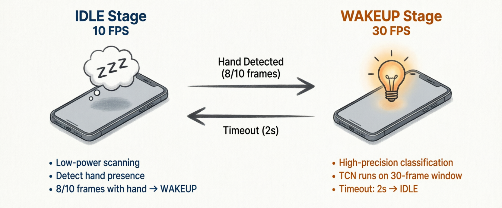
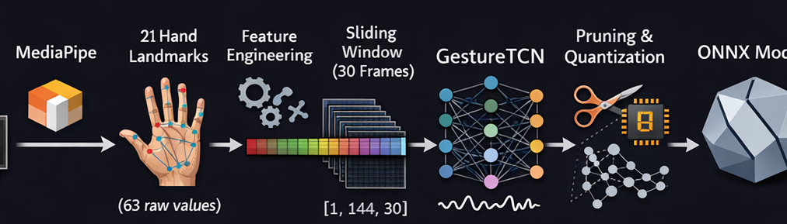
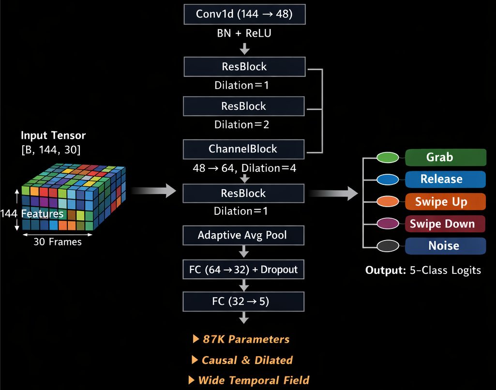

<style>
    .bottom-right {
    position: absolute;
    right: 20px;
    bottom: 20px;
    width: 50%;
  }
</style>


# GrabDrop
## Cross-Device Screenshot Transfer via 
## Air Gesture Recognition

 - *Speaker_A* 
 - *Speaker_B*
 - *Speaker_C*
 - *Speaker_D*


<div class="bottom-right"></div>

<!-- Speaker Notes:
Hello everyone, today we are going to present GrabDrop, a cross-device screenshot transfer system powered by air gesture recognition. I will present the motivation and overview. After me, Speaker_B will cover the AI algorithm design, Speaker_C will talk about system architecture and implementation, and Speaker_D will present our results and future work. 
-->

---

<!-- _class: section-title -->

# Part 1: Motivation & Overview
## *Speaker_A*

---

# The Problem: Cross-Device Screenshot Sharing

**Current pain points** when sharing screenshots between phone and laptop:

 - Chat apps (WeChat, Telegram)
 - Email
 - Cloud storage
 - USB cable

<div class="bottom-right"></div>

<!-- Speaker Notes: 
So let us start with the problem. How do you currently share a screenshot between your devices, like phone, tablet and laptop? You could use a chat app like WeChat/Telegram — but that requires five or more steps: take the screenshot, open the app, select a contact, send, and then open it on the other device. You could use email or cloud storage, but those are even more cumbersome and require internet access. Even a USB cable requires physically connecting the devices. 

The key insight here is that all these methods require too many manual steps and interrupt your workflow.
-->

---

# Inspiration: Huawei Air Gesture

Introduced on select **Harmony OS** devices — grab content from screen and "drop" it to another device using hand gestures.


**Our Goal:**
- Any Android/desktop device
- CV solution only
- Fully **open-source** implementation
- LAN only

<div class="bottom-right"></div>


<!-- Speaker Notes:
Our project is inspired by Huawei's Air Gesture feature of Harmony OS, which lets you grab content from the screen using hand gestures and transfer it to another device. 

However, Huawei's implementation has major limitations — it only works between Huawei devices and requires specific hardware.

Our goal is to remove these restrictions. We want to make this work on any Android device via local network — we tested on Xiaomi — and bridge the gap between phones and laptops, only require a front camera.
-->

---
<video controls width="400" height="600">
  <source src="./assets/demo.mp4" type="video/mp4">
</video>

<div class="bottom-right"></div>


<!--Speaker Notes:
Here is a demo video, we test the screenshot transfer between xiaomi phone and laptop
-->

---
# Workflow

1. Both devices on **same Wi-Fi**

2. **Device A**: Show hand ~1s
   - Close fist (GRAB)
   - Screenshot captured
   - UDP broadcast sent

3. **Device B**: Show hand ~1s
   - Open hand (RELEASE)
   - TCP download
   - Image saved & opened


<div class="bottom-right"></div>


<!--Speaker Notes:
Here is how GrabDrop works at a high level. On Device A, the sender performs a GRAB gesture — that is, transitioning from an open palm to a closed fist in front of the camera. This triggers a screenshot capture and broadcasts the availability to all nearby devices on the same Wi-Fi network. Then, on Device B, the receiver performs a RELEASE gesture — transitioning from a fist to an open palm. This triggers a download of the screenshot from Device A.
-->

---

# Project Foundation

**Topic:** Quantization and Pruning of Lightweight Gesture Classfier

**Task:** 
 - Develop an android and desktop app
 - Train a model for gesture classification

**Our approach:** 
 - Train a lightweight TCN gesture classifier
 - Apply pruning and quantization techniques 

---

# Hand Landmark Detection (MediaPipe)

**MediaPipe Hand Landmarker** — 21 3D landmarks per frame

| Property | Value |
|----------|-------|
| Model | MediaPipe Hand Landmarker (FP16) |
| Size | ~12 MB |
| Output | 21 × (x, y, z) = 63 dims/frame |

<div class="bottom-right"></div>

<!--Speaker Notes:
For hand detection, we use Google MediaPipe Hand Landmarker, a pre-trained model that outputs 21 three-dimensional landmarks on the hand. It has a excellent performance on edge device and takes only about 12 megabytes in size. We run it in VIDEO mode, which enables stateful temporal tracking for more stable detections.
-->

---

# Two-Stage Detection Pipeline


<div></div>


<!--Speaker Notes:
To balances power efficiency with detection accuracy, we designed a two-stage detection pipeline. 

The first stage is the IDLE stage, which runs at a low frame rate of about 10 frames per second. Its job is to detect the presence of a hand. When a hand is detected(e.g, 8 frames out of continuous 10 frames), the system transitions to the WAKEUP stage, which runs at 30 frames per second for high-precision motion tracking.

After it enter WAKEUP state, the following frames captured will be handled to TCNN to do the classification. Let me handle this part -- the core algorithm to Speaker_B.
-->

---

<!-- _class: section-title -->

# Part 2: From Hand Landmarks to Gesture Classification
## *Speaker_B*

<div class="bottom"></div>

<!--
Speaker Notes:
Here is our full pipeline in Part 2. Part 1 covered the two-stage wake-up and MediaPipe landmark extraction. Part 2 focuses on the downstream steps: transforming landmarks into gesture predictions through feature engineering, model training, and deployment optimization.
-->

---

# Feature Engineering (144-dim)

| Feature Group | Dims | Description |
|:--|:--:|:--|
| Normalized Landmarks | 63 | Relative to wrist, scaled by palm size |
| Velocity | 63 | Frame-to-frame landmark difference |
| Wrist Velocity | 3 | Wrist position change |
| Fingertip Distances | 10 | Pairwise distances between 5 fingertips |
| Finger Angles | 5 | Bending angle per finger chain |

> *Wrist-relative + palm-size normalization* → hand-size & position **invariant**

<!--
Speaker Notes:
From MediaPipe's 21 landmarks, we compute a 144-dimensional feature vector per frame. We normalize all landmarks relative to the wrist and divide by palm size, making features invariant to hand position and size. We also compute velocity for motion capture, pairwise fingertip distances for grab/release detection, and finger bending angles for pose discrimination.
-->

---

# Data Augmentation Strategy

<div class="columns">
<div class="col">

### Spatial
- **Rotation** ±5°~15°
- **Scale** 0.85×~1.15×
- **Mirror-X** (non-swipe only)
- **Jitter** σ = 0.003

</div>
<div class="col">

### Temporal
- **Time Warp** (anchor-based)
- **Speed Change** 0.8×~1.2×
- **Temporal Crop** (multi-window)
- **Reverse** (with label swap)

</div>
</div>

> *grab* ↔ *release*, *swipe_up* ↔ *swipe_down* via time reversal
> **~100 videos → 3,000+ training samples**

<!--
Speaker Notes:
Our dataset has only about 100 original videos, so augmentation is critical. We apply spatial transforms like rotation and scaling, and temporal ones like time warping and speed changes. A key insight: reversing a grab video gives a valid release sample, and reversing swipe_up gives swipe_down. This expanded our training set from about 100 videos to over 3000 samples.
-->

---

# GestureTCN Architecture

<div class="bottom-right"></div>

<div class="right">

**Key Design Choices:**
- **Causal convolutions:** No future info (real-time safe)
- **Dilated convolutions:** Large receptive field (covers 30 frames)
- **Residual connections:** Stable gradient flow
- **Only 87K params:** Lightweight for mobile

</div>

<!--
Speaker Notes:
Our model is a lightweight Temporal Convolutional Network with only 87 thousand parameters. The stem projects 144 features to 48 channels. Then residual blocks with increasing dilation — 1, 2, 4 — capture both short-term finger movements and longer-term gesture patterns. All convolutions are causal, meaning each frame only sees past context, essential for real-time streaming. After global pooling, a small head outputs 5-class logits.
-->

---

# Training Strategy

| | |
|:--|:--|
| Optimizer | AdamW (weight decay 1e-3) |
| Learning Rate | 2e-3 → 1e-5 (Cosine Annealing) |
| Label Smoothing | 0.1 (prevent overconfidence) |
| Class Balancing | WeightedRandomSampler |
| Gradient Clipping | max_norm = 2.0 |
| Early Stopping | Patience = 40 epochs |
| Online Augmentation | Jitter + Time Warp at train time |

> Designed for **small dataset** + **class imbalance**

<!--
Speaker Notes:
Our training strategy is tailored for a small, imbalanced dataset. AdamW with cosine annealing decays learning rate smoothly. Label smoothing at 0.1 prevents overconfident predictions — important because we rely on confidence thresholds at inference. WeightedRandomSampler ensures underrepresented classes get sampled fairly. We also apply jitter and time warp as online augmentation for extra regularization.
-->

---

# Deployment Optimization

```

┌──────────────┐      ┌──────────────┐      ┌──────────────┐
│   Original   │      │   Pruned     │      │  Quantized   │
│     FP32     │─────►│    FP32      │─────►│    INT8      │
│  87K params  │      │  46K params  │      │  46K params  │
│   0.34 MB    │      │   0.18 MB    │      │   0.17 MB    │
└──────────────┘      └──────────────┘      └──────────────┘
Structured            Fine-tune            ONNX RT
Pruning 30%          100 epochs         Static PTQ

```

> **1.9× fewer params** | **2× smaller** | Deployed via **ONNX Runtime** on Android

<!--
Speaker Notes:
For mobile deployment, three optimization steps. First, structured pruning removes 30% of channels — entire filters, not individual weights — cutting parameters nearly in half. The pruned model is fine-tuned for 100 epochs to recover accuracy. Finally, ONNX export with INT8 static quantization further reduces size. The result is a 0.17 MB model running on Android.
-->

---

# Pruning & Quantization Details

<div class="columns">
<div class="col">

### Structured Pruning

| Layer | Original | Pruned |
|:--|:--:|:--:|
| stem | 48 | 32 |
| mid | 48 | 32 |
| out | 64 | 48 |
| head | 32 | 24 |

- Channels → **multiple of 8** (SIMD)
- Remove **entire channels** (not weights)
- Fine-tune: 100 epochs, LR = 1e-3

</div>
<div class="col">

### INT8 Quantization

$q = \text{round}(r / s + z)$

```python
quantize_static(
  model_input  = "pruned.onnx",
  model_output = "quantized.onnx",
  calibration_data_reader = calib,
  quant_format = QuantFormat.QDQ,
  weight_type  = QuantType.QInt8,
)
````

* **Calibration** → optimal *s*, *z*
* FP32 → INT8: **4× smaller** per weight
* Runs on **ONNX Runtime** (Android)

</div>
</div>

> Evaluation results will be presented in **Part 4**.

<!--
Speaker Notes:
On the left — structured pruning removes entire channels, not individual weights, so we get real speedup on standard hardware. Channels are rounded to multiples of 8 for SIMD efficiency. On the right — after ONNX export, INT8 static quantization uses calibration data to find optimal scale and zero-point. INT8 is 4 times smaller per element than FP32. The final model runs on Android via ONNX Runtime. That covers our model training and deployment — evaluation results will be in Part 4. Thank you.
-->

---

<!-- _class: section-title -->

# Part 3: System Architecture
## *Speaker_C*

---

# Overall System Architecture

```
┌──────────────────── DEVICE ────────────────────────┐
│                                                    │
│  ┌──────────┐   ┌───────────────┐   ┌──────────┐ │
│  │ Camera   │──►│ MediaPipe     │──►│ Two-Stage│ │
│  │ CameraX/ │   │ Hand Landmark │   │ Pipeline │ │
│  │ OpenCV   │   │ Detector      │   │ IDLE→WAKE│ │
│  └──────────┘   └───────────────┘   └────┬─────┘ │
│                                          │        │
│     GRAB/RELEASE/SWIPE_UP/SWIPE_DOWN ◄───┤        │
│                                          ▼        │
│  ┌──────────────┐  ┌──────────────┐  ┌──────────┐│
│  │Screen Capture│  │Network Mgr   │  │Input Mgr ││
│  │MediaProjection│  │UDP discovery│  │PageUp/Down││
│  │ /spectacle   │  │TCP transfer │  │Keys      ││
│  └──────────────┘  └──────────────┘  └──────────┘│
│                                                    │
│  ┌──────────────┐  ┌──────────────┐              │
│  │Overlay Mgr   │  │Sound Player  │              │
│  │Visual fb     │  │Audio fb      │              │
│  └──────────────┘  └──────────────┘              │
└────────────────────────────────────────────────────┘
```

---

# Android Implementation

| Component | Technology | Role |
|-----------|-----------|------|
| GrabDropService | Foreground Service | Main orchestrator |
| RealGestureDetector | CameraX ImageAnalysis | Frame capture + pipeline |
| HandLandmarkDetector | MediaPipe tasks-vision | 21-landmark detection |
| GestureClassifier | ONNX Runtime Android | TCN inference |
| ScreenCaptureManager | MediaProjection | Screenshot capture |
| NetworkManager | UDP multicast + TCP | Discovery + transfer |
| OverlayManager | WindowManager | Visual feedback |
| SwipeAccessibilityService | AccessibilityService | PageUp/Down dispatch |

**Key challenges:** CameraX in Service, 12 permissions, VirtualDisplay buffering

---

# Desktop Implementation (Python)

| Module | Role |
|--------|------|
| main.py | Orchestrator |
| gesture_detector.py | Camera + two-stage pipeline |
| gesture_classifier.py | TCN model wrapper (ONNX) |
| hand_landmark.py | MediaPipe wrapper |
| screen_capture.py | Multi-backend (spectacle/grim/scrot/mss) |
| network_manager.py | UDP + TCP |
| overlay.py | Tkinter visual feedback |

```
Screen capture chain:
spectacle(KDE) → grim(Wayland) → gnome-screenshot → scrot(X11) → mss
```

---

# Network Protocol

**Zero-configuration LAN** — no pairing, no cloud

| Phase | Transport | Details |
|-------|-----------|---------|
| Discovery | UDP multicast (239.255.77.88:9877) | Heartbeat 3s, timeout 10s |
| Screenshot offer | UDP broadcast | TCP port + file size |
| Transfer | TCP | 4-byte length header + PNG |

**Retroactive matching:** RELEASE before offer → matched within 3s window

---

<!-- _class: section-title -->

# Part 4: Results & Future Work
## *Speaker_D*

---

# Optimization Results

| Metric | Original | Pruned | Pruned+INT8 |
|--------|----------|--------|-------------|
| **Params** | 87,077 | 45,877 | 45,877 |
| **Size** | 0.34 MB | 0.18 MB | 0.17 MB |
| **Compression** | 1.0× | 1.9× | 2.0× |
| **Accuracy** | 88.89% | 92.59% | 92.59% |
| **F1-Score** | 0.888 | 0.929 | 0.929 |
| **Latency (CPU)** | 0.92 ms | 0.79 ms | 1.23 ms |
| **Throughput** | 1087/s | 1271/s | 816/s |

> **Surprising result:** Pruning improved accuracy by +3.7%!

<!-- Speaker Notes：
These are our optimization results, it is obvious that the model after pruning and quantization is almost half of the original model. An amazing fact is that accuracy improves 3.7%!
 -->
---

# Why Did Pruning Improve Accuracy?

**Hypothesis: Pruning acts as implicit regularization**

```
Original model (87K params):
┌───────────────────────────────────────────┐
│ • Overfitting to training distribution    │
│ • Memorizing noise in training data       │
│ • Redundant paths dilute features         │
└───────────────────────────────────────────┘
     ▼ Pruning removes weak connections
┌───────────────────────────────────────────┐
│ • Forced to learn robust features         │
│ • Smaller capacity = better generalization│
│ • Focus on most discriminative patterns   │
└───────────────────────────────────────────┘
```

**Similar findings:** Lottery Ticket Hypothesis (Frankle & Carbin, 2019); Pruned ResNets often generalize better

<!-- Speaker Notes：
And why？
For the oringinal model, it has more params, which will cause some bad effects: overfitting,Memorizing noise in training data. and it has Redundant paths dilute features. After removing weak connections, it can learn robust features. And smaller capacity makes it better generalization, it can focus on most discriminative patterns.
 -->

---

# Per-Class Performance

| True \ Pred | grab | release | swipe_up | swipe_down | noise |
|-------------|------|---------|----------|------------|-------|
| **grab** | 94% | 4% | 0% | 0% | 2% |
| **release** | 3% | 95% | 0% | 0% | 2% |
| **swipe_up** | 0% | 0% | 91% | 5% | 4% |
| **swipe_down** | 0% | 0% | 6% | 90% | 4% |
| **noise** | 2% | 1% | 3% | 2% | 92% |

**Observations:**
- grab/release: Similar motion, reversed in time (~3-4% confusion)
- swipe_up/down: Motion direction confusion (5-6%)

<!-- Speaker Notes：
This grpha shows our performance in each class. Each class has nice performance. Grab and release have 4% confusion, and swipe up and swipe down have 5-6% confusion, caused by the motion direction confusion.
 -->
---

# Strengths

 - **Cross-platform** — Android 10+ + Linux/macOS/Windows
 - **Zero-config** — No pairing, no cloud, no internet
 - **Power-efficient** — Two-stage: 10fps idle, 30fps wakeup (≤2s)
 - **Optimized model** — Pruned + quantized TCN: 2× smaller, +3.7% accuracy
 - **Robust detection** — TCN handles varied hand shapes and lighting

<!-- Speaker Notes：
For our strengths, the grabdorp can be used in many systems eccept IOS. It doesn't have many step to initilize it; you can connect to another device without configuration. And it is Power-efficient, the model is more optimized. It can also adapt to different enviroment for different hands and lighting.
 -->
---

# Limitations

| Limitation | Mitigation |
|------------|------------|
| Lighting sensitivity | Lowered confidence (0.3) |
| No encryption | TLS planned |
| Single hand only | Sufficient for use case |
| Camera angle | Front camera recommended |

<!-- Speaker Notes：
But it also has limitations like Lighting sensitivity,No encryption. It only support single hand, but it is enough.
 -->

---

# Future Work

1. **Apply to larger vision models** — YOLOv8 object detection optimization
2. **Advanced quantization** — QAT, mixed-precision (FP16 + INT8)
3. **Security** — TLS encryption, QR pairing
4. **Extended gestures** — Pinch, rotation, multi-hand
5. **iOS client** — Full ecosystem coverage


<!-- Speaker Notes：
In the future, we are going to use a larger vision model like YOLOv8, use advanced quantization technique. For the security part, we plan to add TLS encryption or QR pairing. And we will support more gestures and IOS client.
 -->
---

# Summary

| Aspect | Contribution |
|--------|--------------|
| **Problem** | Cross-device screenshot sharing — too many steps |
| **Solution** | GrabDrop: open-source, cross-platform air gesture |
| **AI Model** | MediaPipe + TCN (pruned & quantized) |
| **Optimization** | 30% pruning + INT8 PTQ: 2× smaller, +3.7% accuracy |
| **Platforms** | Android + Linux/macOS/Windows |
| **Result** | ~3s transfer, <2ms inference, 0.17MB model |

**GitHub Repo : https://github.com/XUranus/AirGesture**

<!-- Speaker Notes：
After all these steps, we have successfully achieved our goal, which has only 3s to transfer, <2ms inference, 0.17MB model. Our code is open source and welcome by everyone.
 -->

---

<!-- _class: title-slide -->

# Thank You
## Questions?